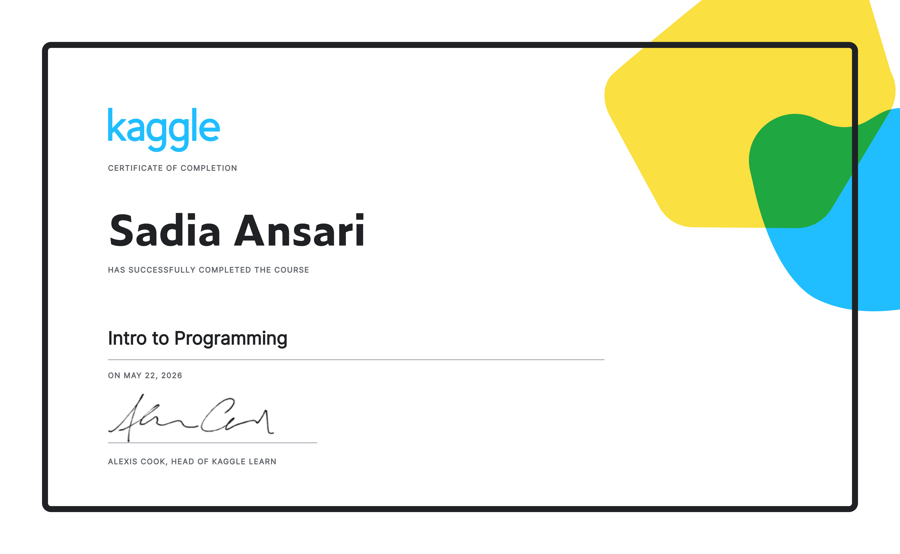

# 🎓 Introduction to Programming Certificate

Welcome to my repository! This project showcases my official certification and the foundational programming skills I have acquired.

## 📜 Certificate
Here is my completion certificate:

---

## 🛠️ Skills Acquired
Through this certification, I have built a solid foundation in programming principles, including:
* **Logic Building:** Understanding how to approach and solve computational problems.
* **Core Concepts:** Variables, data types, and structural logic.
* **Control Flow:** Conditional branching and loops to guide program execution.
* **Code Organization:** Writing clean, readable, and structured code.

---

## 🚀 Connect with Me
If you'd like to discuss programming or collaborate on future projects, feel free to connect:
* **GitHub:** [sadiacoding](https://github.com/sadiacoding)
